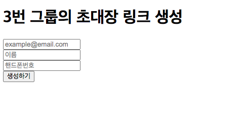
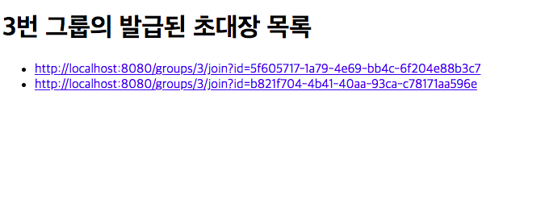
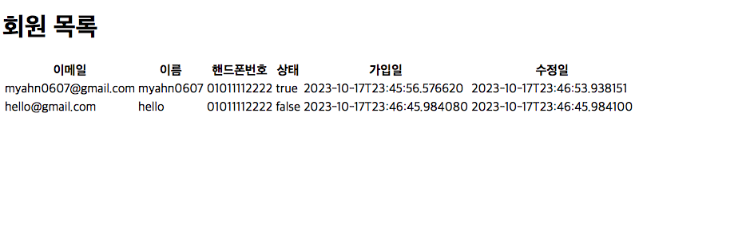

# 백엔드 Pro 미니 과제
## ✍️ 내용
- '회원 초대 링크 생성 기능'을 구현하는 미니 과제
- 별도로 제시된 기능 및 기술 요구 사항을 충족해야함

### 기능 요구 사항
1) 참여자 초대
- 그룹 매니저는 그룹에 참여자를 초대할 수 있다
- 회원 초대 시 DB에 임시 회원을 생성하고 초대 링크를 생성한다
- 생성 시에 회원의 이름, 전화번호, 이메일 주소는 필수 값이다

2) 초대 수락
- 초대 받은 사용자는 그룹 참여 초대 링크를 통해 그룹에 참여할 수 있다
- 초대 링크 수락 시 임시 회원을 활성화하고 초대 링크를 만료한다
- 초대 링크는 1회 사용 시 만료된다
- 이외의 추가 기능 구현에 대한 제약은 X

### 기술 요구 사항
- JAVA 11 이상 또는 Kotiln
- Spring Boot 사용
- Gradle 기반의 프로젝트
- 과제 기능 요구사항은 서버(백엔드)에서 구현/처리
- 구현을 보여줄 수 있는 화면(프론트엔드)은 구현 금지
- DB는 인메모리 DB(ex. h2)를 사용하며, DB 컨트롤은 JPA로 구현


## ✍️ 설명
- 강의 『Part 08. Spring Boot 기반 웹 프로젝트』 를 Chapter 07 까지 수강 후 배운 내용을 토대로 과제 진행
- '회원 초대 링크'를 생성하는 '그룹 매니저'는 이미 가입된 회원이라고 가정

## ✍️ 테이블 설계
### 회원 테이블
| invitation      | 데이터 유형        | 예시값                 | comment                | 비고                                    |
|-----------------|---------------|---------------------|------------------------|---------------------------------------|
| invitationUid   | BIGINT(20)    | 123                 | 초대 고유 ID               | PK, AI                                |
| senderUid       | BIGINT(20)    | 456                 | 초대 보낸 유저 고유 ID         | UQ (senderUid, receiverUid, groupUid) |
| receiverUid     | BIGINT(20)    | 789                 | 초대 받은 유저 고유 ID         | INDEX                                 |
| groupUid        | BIGINT(20)    | 111                 | 그룹 고유 ID               | INDEX                                 |
| invitationAuth  | VARCHAR(1000) | f4de7c32-1fbc-488c  | 초대 링크                  | INDEX	                                |
| isInvited       | TINYINT(4)    | 0	                  | 만료 여부 (0: 초대중, 1: 초대됨) |                                       |
| datetimeAdd     | DATETIME      | 2023-10-16 12:00:00 | 행 추가일                  |                                       |
| datetimeInvited | DATETIME      | 2023-10-16 12:00:00 | 초대 승낙일                 |                                       |
| datetimeExpired | DATETIME      | 2023-10-25 12:00:00 | 초대 링크 만료일              |                                       |

### 초대장 테이블
| member      | 데이터 유형       | 예시값                 | comment  | 비고     |
|-------------|--------------|---------------------|----------|--------|
| memberUid   | BIGINT(20)   | 123                 | 멤버 고유 ID | PK, AI |
| email       | VARCHAR(100) | myahn0607@gmail.com | 이메일      | UQ     |
| name        | VARCHAR(20)  | 얍얍얍                 | 이름       |
| phone       | VARCHAR(12)  | 01011112222         | 핸드폰번호    |
| status      | TINYINT(4)   | 0 (0: 초대중, 1: 승인됨)  | 초대상태     |
| datetimeAdd | DATETIME     | 2023-10-16 12:00:00 | 가입일      |
| datetimeMod | DATETIME     | 2023-10-16 12:00:00 | 수정일      |

## ✍️ API
### 초대 링크 생성 API
POST `/groups/{groupUid}/invitation`  
  
  
  

***

### 발급된 초대 링크 조회 API
GET `/groups/{groupUid}/invitations`  


***


### 초대 승낙 API
GET `/groups/3/{invitationAuth}`  


***

### 회원 조회 API
GET `/members`  


```

## ✍️ 기타
- 기간이 만료된 링크가 저장된 행은 별도 배치 코드에서 일정 기간마다 돌면서 삭제한다고 가정
- memcached를 사용해도 좋을 것 같다고 생각...
- 페이징 구현하기
- 테스트 코드 작성하기
- 에러 응답, 에러 코드, 예외 처리
- 공부를 진행해 나가면서 '우대사항'에 있는 내용과 생각하고 가정했던 부분을 구현해나가면 좋을 것 같음

### 우대사항
- 트래픽이 많고, 저장되어 있는 데이터가 많음을 염두에 둔 구현
- 다수의 서버, 인스턴스에서 동작할 수 있음을 염두에 둔 구현
- 동시성 이슈가 발생할 수 있는 부분을 염두에 둔 구현
- 생성 이후 일정 시간동안 만료되지 않은 초대 링크의 자동 만료를 염두에 둔 구현

## ✍️ 참고 블로그
- [마크다운 표 만들기](https://inasie.github.io/it%EC%9D%BC%EB%B0%98/%EB%A7%88%ED%81%AC%EB%8B%A4%EC%9A%B4-%ED%91%9C-%EB%A7%8C%EB%93%A4%EA%B8%B0/)
- [스프링 부트에서 URL로 파라미터를 전달하는 2가지 방법](https://youngjinmo.github.io/2021/01/spring-request-parameter/)
- [REST API 설계 (네이밍)](https://server-engineer.tistory.com/886)
- [JPA Table에 Index 설정하기](https://herojoon-dev.tistory.com/142)
- [JPA Table에 Unique 설정하기](https://velog.io/@hwan2da/JPA-Columnuniquetrue-UniqueConstraints)
- [JPA 기본값 설정하기](https://velog.io/@minji/%EC%8A%A4%ED%94%84%EB%A7%81%EB%B6%80%ED%8A%B8-JPA-%EC%97%94%ED%8B%B0%ED%8B%B0-%EC%BB%AC%EB%9F%BC-default-value-%EC%84%A4%EC%A0%95%ED%95%98%EA%B8%B0-ColumnDefault-Builder.Default-%EC%B0%A8%EC%9D%B4)
- [JPA 동시성 문제 해결하기 (낙관적 락, 비관적 락)](https://braindisk.tistory.com/89)
- [JPA Transactional과 쓰기지연 쿼리에 대한 간단한 이슈 정리](https://beaniejoy.tistory.com/91)
- [JPA에서 Transaction 활용하기](https://velog.io/@stpn94/JPA%EC%97%90%EC%84%9C-Transaction-%ED%99%9C%EC%9A%A9%ED%95%98%EA%B8%B0-1)
- [JPA 기본 키 생성 전략](https://velog.io/@gillog/JPA-%EA%B8%B0%EB%B3%B8-%ED%82%A4-%EC%83%9D%EC%84%B1-%EC%A0%84%EB%9E%B5IDENTITY-SEQUENCE-TABLE)
- [JPA findBy Multiple Columns](https://bushansirgur.in/spring-data-jpa-finder-query-methods-by-multiple-field-names-with-examples/)
- [JPA Boolean instead of bit or char](https://stackoverflow.com/questions/3383169/hibernate-jpa-mysql-and-tinyint1-for-boolean-instead-of-bit-or-char)
- [Java UUID 이해 및 사용방법](https://adjh54.tistory.com/142)
- [Java 날짜 더하고 빼기](https://blog.leocat.kr/notes/2017/07/25/java-add-days)
- [Java private static final](https://zorba91.tistory.com/275)